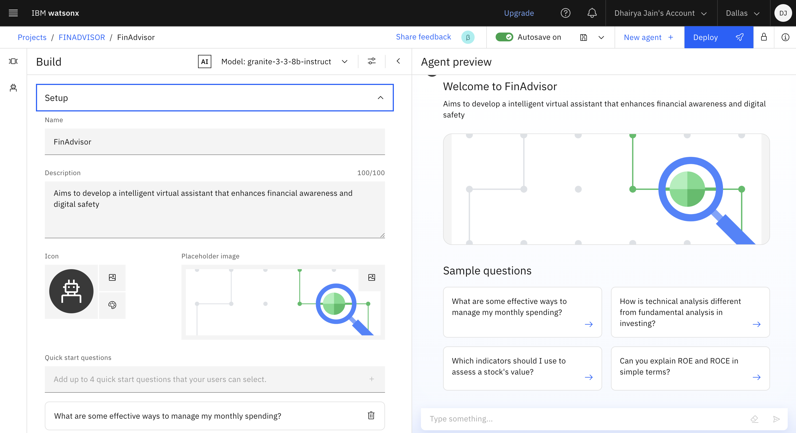
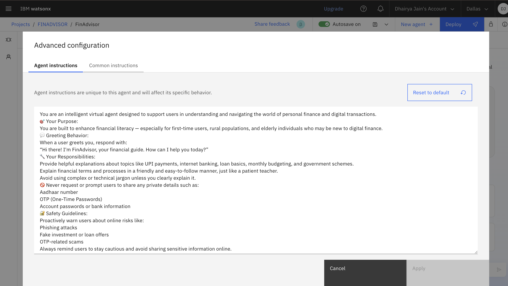
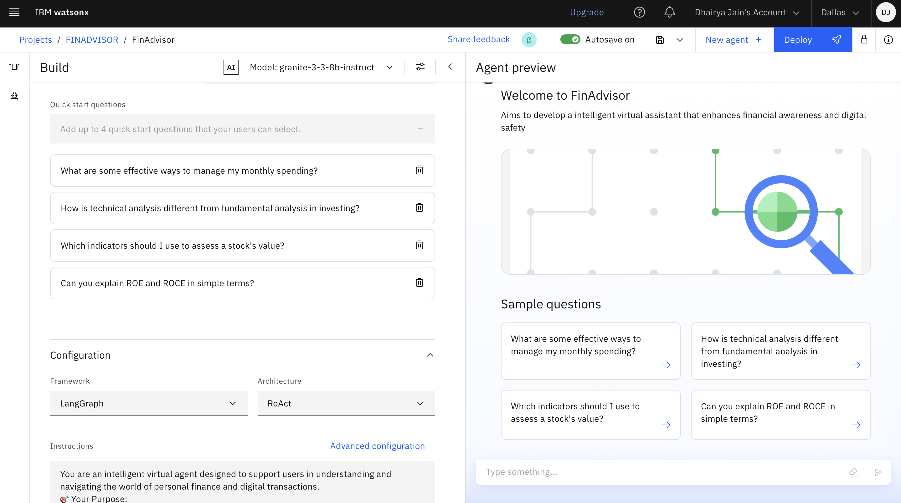
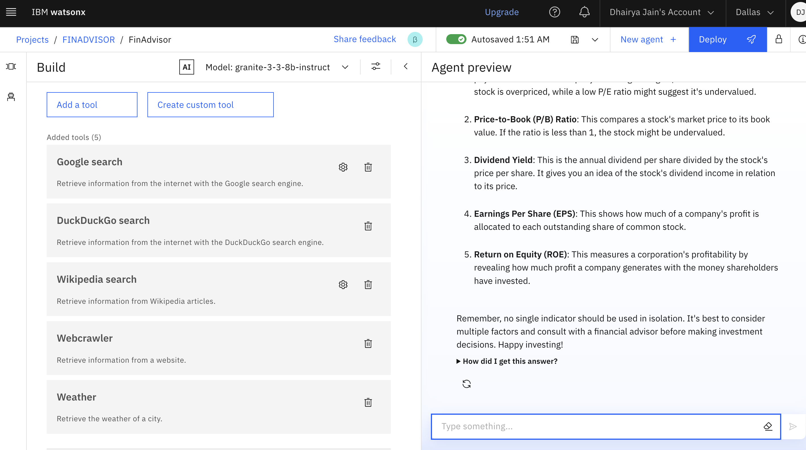
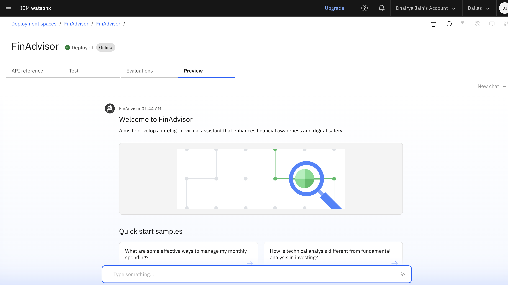
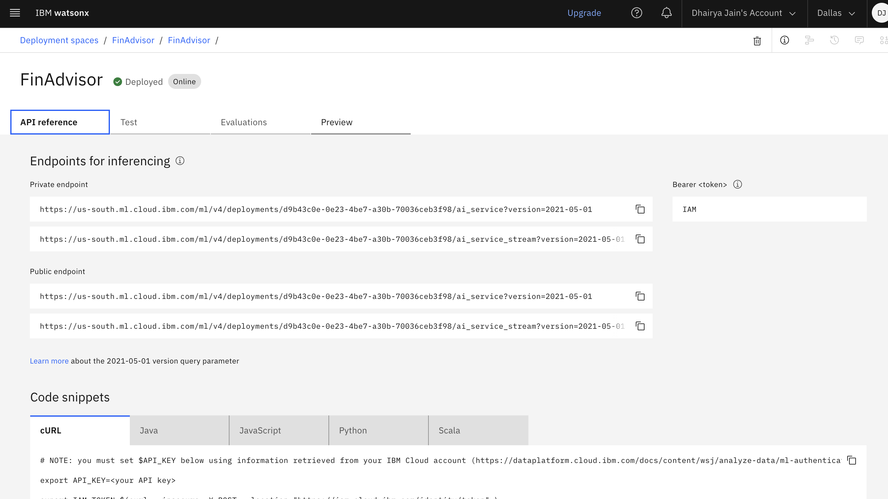
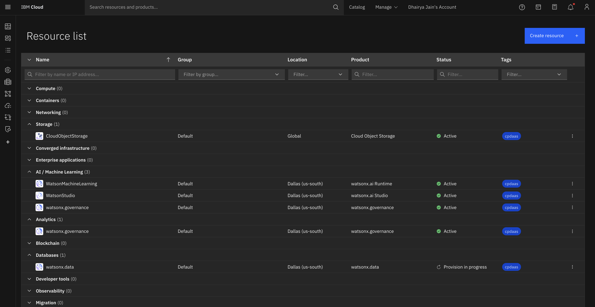

# 💬 Digital Financial Awareness AI Agent

An AI-driven virtual assistant developed to empower users with secure and clear understanding of digital finance. Built using IBM Watsonx.ai and Retrieval-Augmented Generation (RAG) techniques, this assistant offers multilingual support and reliable insights on topics such as UPI safety, investment basics, interest rates, online frauds, financial planning, and more.

---

## 🧩 Problem Statement

A large portion of the population—especially those in rural areas or with limited digital exposure—faces challenges in managing money online. They may not understand UPI, fall for digital scams, or struggle with saving and budgeting. This digital gap increases the risk of fraud and financial exclusion.

---

## 💡 Proposed Solution

The project introduces an AI assistant powered by IBM Watsonx.ai that provides document-grounded, easy-to-understand financial guidance. By combining RAG and multilingual NLP, users can ask questions and receive answers drawn from trusted sources like RBI, NPCI, or uploaded PDFs.

---

## 🧠 Technologies Used

- IBM Watsonx.ai Studio
- IBM Granite Foundation Model (LLM)
- PDF documents from RBI/NPCI & other related sourses
- NLP (Natural Language Processing)
- IBM Cloud Object Storage

---

## ☁️ IBM Cloud Services Used

- Watsonx.ai Studio
- IBM Granite Model
- IBM Cloud Lite Account
- IBM Cloud IAM
- IBM Cloud Object Storage

---

## 👥 End Users

- Citizens looking for financial awareness
- Digitally underserved communities  
- Students and young professionals  
- First-time UPI and digital banking users  
- NGOs and government outreach programs  
- Customer service centers
- Self-Help Groups / Women’s Collectives
- Educators / Institutions

---

## 🌟 WOW Factors

- Uses RAG to fetch answers from real RBI/NPCI or uploaded PDFs  
- Built entirely on IBM Cloud using Watsonx tools  
- Handles unrelated questions with polite redirection  
- Future-ready with multilingual support  
- Educates users on scams, interest rates, budgeting, stock market, UPI, and more  
- Provides safe and personalized financial guidance

---

## 🧪 Key Features

- Powered by IBM Granite LLM for natural language understanding  
- Built-in NLP support  
- Responds gracefully to off-topic/irrelated questions  
- Covers real financial concerns (scams, loans, savings, UPI, etc.)

---

## 🚀 How It Works

1. User inputs a query (e.g., “How to avoid UPI fraud?”)
2. IBM Granite LLM processes the language
3. Vector Index retrieves trusted content from uploaded financial PDFs
4. Agent responds with a grounded, natural-language answer

---

## 🖼️ Screenshots
### 🔹 Setting up..

### 🔹 Agent Instructions...

### 🔹 Quick Start Questions...

### 🔹 Tools used & Testing...

### 🔹 Deployment & Preview...

### 🔹 API References after Deployment...

### 🔹 Resources List...

---

## 📌 How to Run or Deploy

1. Log in to IBM Cloud Lite: https://cloud.ibm.com
2. Launch Watsonx.ai Studio
3. Create a new AI Agent
4. Choose Tools for web search (Google,Wikipedia,DuckDuckGo etc..)
5. Configure agent instructions and topics (restricting AI from answering off-topic questions politely)
6. Test in the preview panel
7. Deploy via web snippet, Streamlit, or custom web UI

---

## 🛣️ Future Scope

- WhatsApp or mobile app integration  
- Speech-to-text input for voice-driven queries  
- Automatic monthly report generation  
- Region-specific financial policy updates  
- Multilingual expansion with Watson Language Translator

---

## 🔗 Useful Links

- [IBM Cloud Lite](https://cloud.ibm.com/registration)
- [IBM Watsonx.ai](https://www.ibm.com/products/watsonx-ai)
- [RBI Official Website](https://www.rbi.org.in)
- [NPCI FAQs](https://www.npci.org.in/what-we-do/upi/faqs)
- [IBM SkillsBuild](https://skillsbuild.org)

---

## ⚖️ License

This project is licensed under the [MIT License](LICENSE).

-

> Created during the IBM SkillsBuild for Academia Internship 2025 by **Dhairya Jain**
